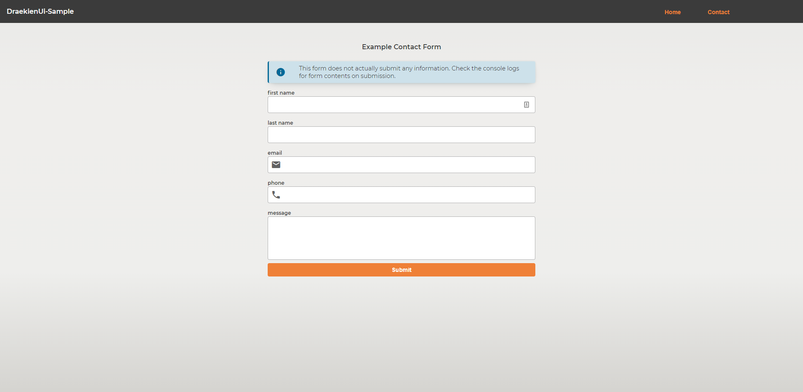
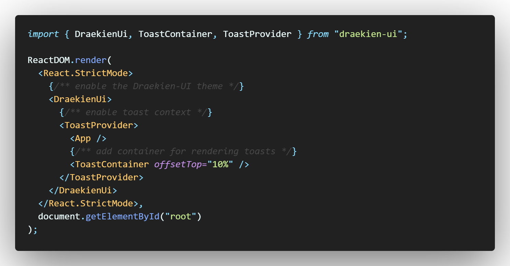

# Draekien-UI Sample Website

- [Information](#information)
- [Setup](#setup)

## Information

This repository is intended to serve as an example repository for using [Draekien-UI](https://www.github.com/draekien/draekien-ui) in a website.

Checkout `src/index.tsx` and `src/App.tsx` to see the code in action.

## Setup

Do the below in your app's `index.tsx` to enable the UI library

